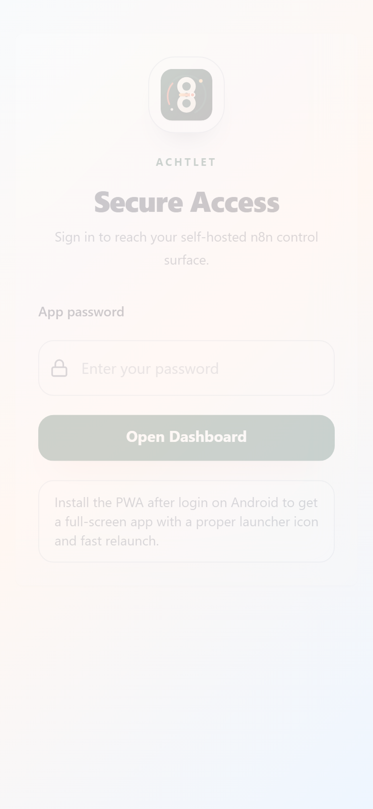
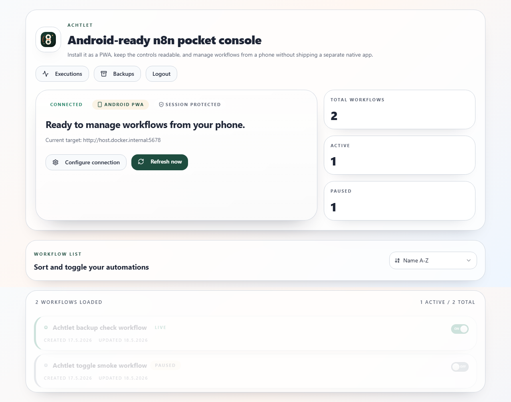
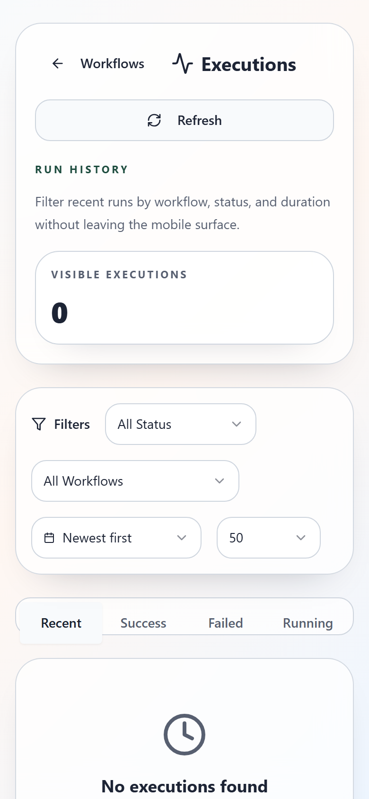
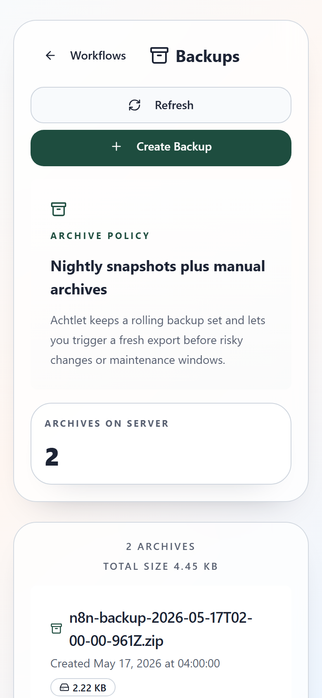
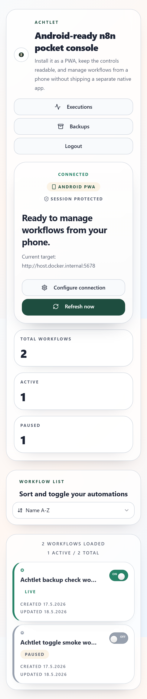

# Achtlet - mobile n8n pocket console


An installable, Android-friendly PWA for managing a self-hosted
[n8n](https://n8n.io) instance from your phone: toggle workflows, inspect
executions, trigger backups, and check status without opening the full n8n
editor.

> Achtlet is an independent community project and is not affiliated with n8n GmbH.
> See [DISCLAIMER.md](./DISCLAIMER.md).

## Screenshots

| Login | Connected dashboard |
| :---: | :---: |
|  |  |

| Executions | Backups | Mobile workflow controls |
| :---: | :---: | :---: |
|  |  |  |

## Features

- Installable phone-first PWA with Android launcher icon and standalone mode.
- View, sort, and toggle workflows from a self-hosted n8n instance.
- Inspect recent executions by workflow, status, duration, and run state.
- Create on-demand workflow backups and keep rolling scheduled archives.
- Password-gated UI with server-side sessions and no API key echo back to the browser.
- n8n connection can be stored server-side or locked through environment variables.
- Dockerfile and `docker-compose.yml` for one-command self-hosting.

## Architecture

```text
Phone PWA (React)
  -> Achtlet Express API, session cookie
  -> n8n REST API, n8n API key
```

Directory layout:

```text
client/       Vite + React web UI
server/       Express backend
shared/       Shared TypeScript types
android-app/  Archived Expo prototype, not the release target
```

## Requirements

- Node.js 20+
- npm 10+
- A reachable n8n instance with a valid API key
- Optional: Docker Desktop / Docker 24+ for container deployment

## Quick Start

```bash
git clone https://github.com/grzgrzgrzgrzgrz/achtlet.git
cd achtlet
npm install

cp .env.example .env
# edit .env and set at least:
#   APP_PASSWORD=<strong unique password>
#   SESSION_SECRET=<openssl rand -base64 32>

npm run dev
```

Open http://localhost:5000, sign in, and configure your n8n URL plus API key in
the app. If you prefer immutable server-side config, set `N8N_URL` and
`N8N_API_KEY` in `.env`.

## Docker

```bash
cp .env.example .env
# edit .env and set APP_PASSWORD + SESSION_SECRET

docker compose up -d
```

Achtlet listens on port `5000` and exposes `/api/health`.

The compose setup intentionally has no secret fallbacks. It also runs the
container with a read-only root filesystem, dropped Linux capabilities,
`no-new-privileges`, and named volumes for:

- `/app/data` - saved n8n connection config
- `/app/backups` - backup archives

Put Achtlet behind a reverse proxy that terminates HTTPS before exposing it beyond
localhost.

## Environment

See [.env.example](./.env.example) for the full list.

| Variable | Required | Description |
| --- | :---: | --- |
| `APP_PASSWORD` | yes | Password that unlocks the Achtlet UI. |
| `SESSION_SECRET` | yes | Random string, at least 32 characters, used for session signing. |
| `N8N_URL` | no | n8n URL. Can also be configured in the UI. |
| `N8N_API_KEY` | no | n8n API key. Can also be configured in the UI. |
| `DATA_DIR` | no | Directory for persisted connection config. |
| `BACKUP_KEEP_LAST` | no | Number of backup archives to retain locally. |
| `TZ` | no | IANA timezone for scheduled backups. |

Generate a session secret with:

```bash
openssl rand -base64 32
```

## Security

Achtlet is a thin management layer around the n8n API, so treat it like an admin
surface:

- Always use HTTPS outside localhost.
- Use a strong, unique `APP_PASSWORD`.
- Keep `SESSION_SECRET`, `N8N_API_KEY`, `.env`, `/app/data`, and `/app/backups`
  out of version control.
- Treat backup archives as sensitive.

Release hardening currently includes:

- server-side sessions with HTTP-only cookies
- rate-limited login attempts
- hardened browser headers including CSP and `frame-ancestors 'none'`
- same-origin guard for state-changing API requests
- API responses marked `no-store`
- no third-party font requests from the PWA
- non-root Docker runtime, read-only root filesystem, dropped capabilities
- CI typecheck, unit tests, production dependency audit, and Docker build
- Dependabot, CodeQL, dependency review, and committed-secret scanning workflows

Report vulnerabilities privately as described in [SECURITY.md](./SECURITY.md).

## As-Is Release Note

This is community software, published as-is. I did what I could for this
release: tests, Docker Desktop validation, local n8n integration testing,
Playwright screenshots, dependency audit, and secret scans. Still, there is no
warranty and no guarantee that it fits your environment.

Please review the code before trusting it with an important n8n instance. Adapt
it with Codex, Claude, or whatever toolchain you like, but rerun the checks and
own the final deployment decision.

## Development Checks

```bash
npm run check
npm test
npm audit --omit=dev
npm run build
docker build -t achtlet-ci .
```

## Android Install

1. Open Achtlet in Chrome on Android.
2. Sign in and configure your n8n connection.
3. Use the in-app install prompt or Chrome menu to install it.

The `android-app/` directory is an archived Expo prototype. The supported
release target is the PWA.

## License

[MIT](./LICENSE) Copyright (c) 2026 Grzegorz Olszowka
